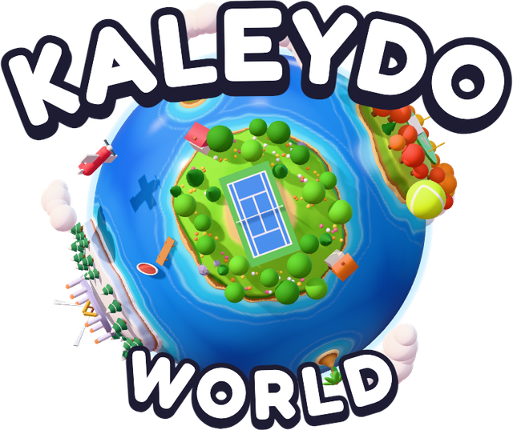
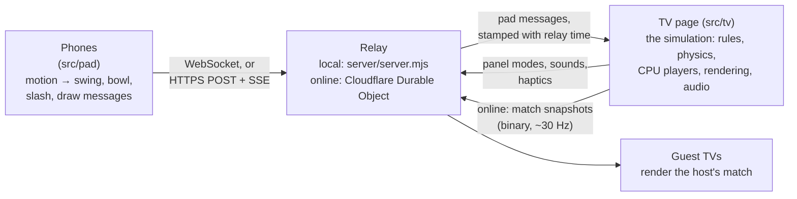

<p align="center">
  
</p>

<p align="center">
  <b>Motion-controlled sports in your browser. Your phone is the remote; any screen is the TV.</b><br>
  Tennis, bowling, sword duels, archery and a home run derby, across nine art-style worlds that shatter into each other.
</p>

<!-- trailer: drag the mp4 into a GitHub comment and paste the link here -->

<p align="center">
  <a href="https://github.com/veersaraf/kaleydo-world/actions/workflows/ci.yml"></a>
  <a href="LICENSE"></a>
  <a href="https://kaleydo.world"></a>
</p>

A game in the spirit of Wii Sports, with nothing to install: swing your phone like a racket, roll a
bowling ball with your arm, slash with a sword, draw a bow, swing a bat. Up to four phones play on one
screen (local versus gets a split screen), and TVs in different places can play together online by room
code or quick match. Every character, world, shader, song and sound effect is generated in code: there
are no 3D models, textures or audio files.

- **Sports:** tennis (singles or doubles, four CPU levels, and an optional **Rush** pace where every
  rally shot gets faster until the ball catches fire), ten-pin bowling with rigid-body pins, and, in
  beta, sword duels, archery and a home run derby.
- **Worlds:** Sports Park, Sunny Plaza, Inkwell (sumi-e ink), Neon Drive (synthwave), Bit Kingdom
  (8-bit), Paper Isles (pop-up book), Clayland (stop-motion clay), Aquarelle (watercolour) and Starfall
  (low gravity). Each has its own look, post-processing and music, and during a rally every hit plays
  the next note of the song.
- **Kaleydo mode:** big moments (a deep rally, a strike, a home run) shatter the world like a
  kaleidoscope into the next one, mid-game.

## Play now

Open **<https://kaleydo.world>** on any big screen (a laptop, or a TV with a browser), scan the QR code
with your phone's camera, and swing. The phone becomes a remote straight away: no app, no account, no
certificate. Friends join the same screen by scanning the same code.

## Run it yourself in 60 seconds

You need **Node 20.19 or newer** (22+ recommended), a desktop browser, and a phone on the **same
Wi-Fi** as the computer. No internet connection is needed once it's installed.

```bash
git clone https://github.com/veersaraf/kaleydo-world.git && cd kaleydo-world && npm install && npm start
```

`npm start` builds the game, starts a small local server and opens <http://localhost:3000>. The
terminal prints the phone address and a QR code, and the game shows the same QR code. Click the game
window once (browsers need a click before they play sound) and press <kbd>F</kbd> for full screen.
Scan the QR code with your phone, type your name, pick your hand and tap **Join game**.

Something not working? Run:

```bash
npm run doctor
```

It checks Node, the build, the two ports (3000 and 3443), the network address your phone will use,
the firewall (macOS) and the local certificates, and prints a one-line fix for anything that's off.

**The certificate warning (once per phone).** Phones only give motion sensors to secure (https) pages,
so the server makes its own certificate on your computer, and the first time the phone warns about it:

- **iPhone (Safari):** "This Connection Is Not Private" → **Show Details** → **visit this website** →
  **Visit Website**, then allow motion access when asked.
- **Android (Chrome):** **Advanced** → **Proceed**.
- If macOS asks whether `node` may accept incoming connections, choose **Allow**.

*Optional:* the phone's join page has *"remove the security warning"*: a one-time setup that installs
the certificate (it appears as "KALEIDO Local CA") so the warning never comes back and the remote can use
WebSockets, which shave a little latency.

<details>
<summary><b>Troubleshooting</b></summary>

- **The phone can't reach the game:** same Wi-Fi? No VPN on either device? Guest and office networks
  often keep devices apart: try a home network or a phone hotspot. `npm run doctor` shows the address.
- **"Port 3000 is already in use":** another copy is running, or something else holds the port.
  `npm run doctor` says what; or pick other ports: `PORT=3100 HTTPS_PORT=3543 npm start`.
- **No sound on the computer:** click the game window once.
- **No sound on the phone:** turn the volume up (it plays through the silent switch on iOS 17+).
- **Swings aren't detected:** allow Motion & Orientation access when asked. If you denied it on an
  iPhone: Settings → Apps → Safari → Advanced → Website Data, remove the game's address, and rejoin.
  The remote's ⚙ menu has a sensitivity setting (*Big swings / Normal / Light swings*).
- **Too hard or too easy:** change the CPU level on the sport's setup screen.

</details>

The game was developed on macOS with iPhones as remotes. The local server is plain Node, so Linux and
Windows should work too; reports and fixes are welcome.

## Host your own online copy

The hosted version runs on Cloudflare Workers: the Worker serves the built game, and each TV's room is a
Durable Object that relays between the TV, its phones and any guest TVs. With a real domain the site has
a real certificate, so phones get motion sensors with no warning, and **Play online** (rooms by code,
quick match) is switched on. The free plan is plenty for a hobby game: idle rooms hibernate and cost
nothing.

[](https://deploy.workers.cloudflare.com/?url=https://github.com/veersaraf/kaleydo-world)

The button copies this repo into your GitHub account and sets up a Worker that builds and deploys it on
every push. Or deploy from your own clone (Node 22+):

```bash
npx wrangler login     # once: sign in to your Cloudflare account
npm run cloud:deploy   # build, then publish to <name>.<your-subdomain>.workers.dev
npm run cloud:dev      # or try it locally first on http://127.0.0.1:8787
```

To use your own domain: Cloudflare dashboard → Workers & Pages → your Worker → Settings → Domains &
Routes. The Worker is named `kaleido` in `wrangler.jsonc`; change `name` there for a different one.

## Controls

Every sport can also be played with a mouse and keyboard on the computer (handy for trying it out).
Your player runs to the ball by themselves: you decide *when* and *how* to swing.

### Tennis

| | Phone | Keyboard / mouse |
|---|---|---|
| Hit | swing like a racket | flick the mouse (up = topspin, down = slice) |
| Aim | swing early → cross-court, late → down the line | same |
| Power | swing speed | flick speed, or <kbd>Shift</kbd>+<kbd>J</kbd> |
| Spin | brush up = topspin, chop down = slice | <kbd>J</kbd> flat · <kbd>K</kbd> topspin · <kbd>L</kbd> slice |
| Lob / drop | soft upward / soft downward swing | <kbd>U</kbd> lob · <kbd>I</kbd> drop |
| Serve | lift the phone to toss (or tap), swing at the top; nail it for a **rocket serve** | <kbd>Space</kbd> or click to toss, then swing |
| Menus | D-pad, **A**, **B** | arrows, <kbd>Enter</kbd>, <kbd>Esc</kbd> |
| Pause | Home | <kbd>Esc</kbd> / <kbd>P</kbd> |

Balls at the edge of reach get a lunge or a flying dive. Run your opponent corner to corner and they
tire, floating weak returns: swing hard at those for a **SMASH**. A first-timer gets a short demo at
their first serve and return (*How to play → Tennis → Show me* plays it again).

### Bowling

| | Phone | Keyboard / mouse |
|---|---|---|
| Bowl | **hold** the ball on screen, swing your arm back and through, **let go** at the bottom | hold <kbd>Space</kbd> (or the mouse button) and let go, or flick the mouse up |
| Speed | how fast you swing | flick speed |
| Hook | twist your wrist as you let go | <kbd>J</kbd> straight · <kbd>K</kbd> hook left · <kbd>L</kbd> hook right |
| Move / aim | ◀ ▶ step, ↖ ↗ turn the aim line | arrow keys |

You start where a straight ball meets the pocket. A hook curves late, so to hook into the pocket, move
right (left-handers: left) and aim out a little.

### Sword duel (beta)

| | Phone | Keyboard / mouse |
|---|---|---|
| Strike | swing the phone in any direction | arrow keys, or drag the mouse |
| Thrust | push the phone towards the screen | <kbd>X</kbd> |
| Guard | hold **GUARD** with the sword *across* their swing (upright stops side swings, flat stops chops) | hold <kbd>Space</kbd>, or the right mouse button |
| Re-center | point the phone at the screen and tap ⌖ | |

A blocked attacker is stunned for a moment. Knock them off the platform to take the round; best of three.

### Archery (beta)

| | Phone | Keyboard / mouse |
|---|---|---|
| Draw | hold **DRAW** | hold the mouse button or <kbd>Space</kbd> |
| Aim | point the phone | the cursor; arrow keys fine-tune |
| Shoot | let go | let go |

The sight allows for the drop; the wind is yours to judge. Balloons are bonus points.

### Home Run Derby (beta)

| | Phone | Keyboard / mouse |
|---|---|---|
| Swing | hold the phone in both hands like a bat and swing as the ball reaches the plate | <kbd>Space</kbd>, or flick the mouse (up = an uppercut) |

On time goes to centre field, early pulls it, late pushes it the other way. Swing speed is distance.

## How it works



The **TV page is the game**: it runs every rule, physics step and CPU player, and draws the worlds with
three.js. **Phones are remotes**: they turn motion sensors into a few small messages (a swing with its
power and spin, a bowling release, a slash) and show a panel the TV picks. The **relay** only routes:
on your computer it's `server/server.mjs` (HTTP for the TV page, HTTPS for phones, with its own
certificate authority); online it's a Cloudflare Worker with a Durable Object per room
(`cloud/worker.ts`). In online play the host TV still runs the only simulation and streams compact
snapshots to guest TVs, whose own phones join the host's room directly.

**Latency compensation:** each phone message says how old the motion is and the phone's measured
delay to the relay, so the TV resolves a swing as of the moment it physically happened (up to a quarter
of a second back), not when it arrived; a friend 100 ms away swings as accurately as someone on the
couch. Guest TVs play the host's snapshots a little behind with a jitter buffer that adapts to the
connection, evaluating the ball's exact flight so nothing ever teleports.

More in [docs/architecture.md](docs/architecture.md), and how a world is built in
[docs/worlds.md](docs/worlds.md).

## Make your own game mode

A tennis variant is mostly a flag on the match's config plus a few lines in the rules; the **Rush**
pace is a complete worked example (a 50-line module, a few hooks in the rules, one setup-screen tile
and one field in the online stream). [docs/game-modes.md](docs/game-modes.md) walks through it step by step, including
bowling's equivalents, new phone panels, tests, and what online play needs.

## Project layout

```
src/
  tv/           the TV page: the game
    app.ts        renderer, main loop, starting and stopping each sport
    flow.ts       menus, setup screens, match lifecycle, Kaleydo shifts, which panel each phone shows
    tennis/       ball flight, shot solver, rules (match.ts), Rush (rush.ts), CPU, camera, first-time demo
    bowling/      lane model, Rapier pins, scoring, referee (game.ts), CPU bowlers, alley, animation
    duel/ archery/ baseball/   the other sports: rules, CPU, venue, animation, camera
    worlds/       one file per world (+ *-env/ scenery), base.ts is what they share
    chars/        procedural characters and animation
    render/       post-processing, the shatter transition, particles, quality ladder
    audio/        synthesised instruments, sequencer, songs, sound effects, crowd
    net/          online: the host's match stream and the guest's playback
    core/         input (phones, mouse, keyboard), the relay link, maths
    ui/           HUDs, menus, join card, room screens
  pad/          the phone remote: motion pipeline, swing / bowl / sword detectors, transport, panels
  shared/       protocol.ts (every message), net.ts (the online snapshot codec)
server/         the local server: relay, certificates, join page, doctor
cloud/          the Cloudflare Worker: rooms (worker.ts) and quick-match lobby (lobby.ts)
scripts/        check/ (headless tests and sims), e2e/ (browser tests), perf/, shots/, tools/, lib/
public/         icons, the logo and intro video (rendered from the game's own globe)
```

## Testing

```bash
npm test            # typecheck + the fast headless checks (rules, scoring, detectors, codec)
npm run test:sims   # headless CPU-vs-CPU and simulated-player matches for every sport
npm run test:e2e    # browser end-to-end: simulated phones play on the real TV page
                    # (starts its own server; needs Google Chrome installed)
npm run test:cloud  # rooms, quick match and online play against a local Cloudflare dev server
npm run dev         # live-reload dev server while you work
```

The end-to-end tests drive a real TV page and real remote pages in headless Chrome, with a simulated
phone that produces physically consistent motion-sensor events (`scripts/lib/fake-phone.mjs`).

## Contributing

Bug reports, new game modes, new worlds and fixes are all welcome. See
[CONTRIBUTING.md](CONTRIBUTING.md) for setup, the checks to run and the PR checklist, and please follow
the [Code of Conduct](CODE_OF_CONDUCT.md).

## Credits and license

Made by [Veer Saraf](https://github.com/veersaraf). Built with [three.js](https://threejs.org),
[Rapier](https://rapier.rs) (bowling pins), [Vite](https://vite.dev), [ws](https://github.com/websockets/ws),
[node-forge](https://github.com/digitalbazaar/forge) and [qrcode](https://github.com/soldair/node-qrcode),
with fonts from [Fontsource](https://fontsource.org) (SIL Open Font License and Apache 2.0).

Code released under the [MIT License](LICENSE).

Kaleydo World is an independent project. It is not affiliated with, endorsed by or connected to
Nintendo; "Wii Sports" is mentioned only to describe the kind of game this is, and is a trademark of
its owner.
